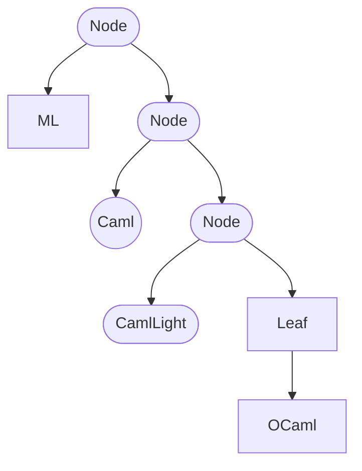

<!--
**What you'll learn**:
* What is a higher-order function
* What are some common higher-order functions
* What is function composition
* How to compose functions
* How to make reusable functions
* How to make functions fit anywhere

**(INTERNAL): journey:**
* introduction – motivate the existence of higher-order functions with an example
* how do i make new functions from existing functions?
* composing pipelines and `|>`
    * t-first vs t-last
* point-free composition
    * how we can do it
    * why we don't do it
* usual gotchas / patterns
    * i need a function that does nothing: Fun.id
    * my function is backwards: flip
    * my function takes too many params:
        * if you can, name it
        * partial application in pipelines
        * they're in the wrong order
            * lambda wrappers (fun x -> f 123 x true)
-->

## Introduction

In OCaml, working with functions quickly becomes second nature. We like to think that _functions describe the world_, and like that, we usually write functions that describe how something behaves.

Take for example a function that says hello to a person by name:

```ocaml
# let say_hi name = print_string ("Hello, " ^ name ^ "!\n") ;;
val say_hi : string -> unit = <fun>
```

We can call this function several times, to say "hello" to several people:

```ocaml
#say_hi "Xavier";;
Hello, Xavier!
- : unit = ()

# say_hi "Sabine";;
Hello, Sabine!
- : unit = ()

# say_hi "Joe";;
Hello, Joe!
- : unit = ()
```

If we wanted to say "hello" to the same person multiple times, we'd just _repeat_ the same line of code.

```ocaml
# say_hi "Camel";;
Hello, Camel!
- : unit = ()

# say_hi "Camel";;
Hello, Camel!
- : unit = ()

# say_hi "Camel";;
Hello, Camel!
- : unit = ()
```

One way we can avoid having to repeat these lines every time is by writing a function to say "hi" 3 times:

```ocaml
# let say_hi_3_times name =
  say_hi name;
  say_hi name;
  say_hi name
;;
val say_hi_3_times : string -> unit = <fun>
```

In this function we can see a few behaviors:
* It says "hi" to the same name.
* It repeats it exactly 3 times.

But what would happen if we wanted to say "hi" 2 times? Or 4 or 12 times?

When this happens, it usually means that the function is making certain decision that it shouldn't. In other words, the function **knows something** (like the number of times).

So instead, we will create a function that **lets the caller decide** how many times to say "hi." We do this by requiring a new argument, in this case, `times`:

```ocaml
# let rec say_many_hi times name =
  if times < 1 then ()
  else begin
    say_hi name;
    say_many_hi (times - 1) name
  end
;;
val say_many_hi : int -> string -> unit = <fun>
```

Much better. Now we can call:

```ocaml
# say_many_hi 3 "Xavier";;
Hello, Xavier!
Hello, Xavier!
Hello, Xavier!
- : unit = ()

# say_many_hi 12 "Camel";;
Hello, Camel!
Hello, Camel!
Hello, Camel!
Hello, Camel!
Hello, Camel!
Hello, Camel!
Hello, Camel!
Hello, Camel!
Hello, Camel!
Hello, Camel!
Hello, Camel!
Hello, Camel!
- : unit = ()
```

Unfortunately, reusing this _repetition_ behaviour isn't so easy because we have hard-coded our call to `say_hi`.

To make this reusable, we can **let the caller decide** what our function should do:

```ocaml
# let rec repeat times thing_to_do =
  if times < 1 then ()
  else begin
    thing_to_do;
    repeat (times - 1) thing_to_do
  end
;;
val repeat : int -> 'a -> unit = <fun>
```

But what should `thing_to_do` be? Our intuition may be that we can call:

```ocaml
# repeat 3 (say_hi "Camel");;
Hello, Camel!
- : unit = ()
```

But our program only outputs one salutation:

```text
Hello, Camel!
```

That is not what we want! We want it to say "hello" to Camel 3 times.

In OCaml, the arguments are evaluated before the function itself, so in this case, we ended up saying "hi" before we even got to the repeat function.

We can let `repeat` call `say_hi` many times by _delaying_ the function's execution by wrapping it with another function, like this:

```ocaml
# repeat 3 (
fun () ->
    say_hi "Camel");;
```

This means we must refactor our `repeat` function, by replacing `thing_to_do` with `thing_to_do ()`, to _call_ our new function:

```ocaml
let rec repeat times thing_to_do =
  if times < 1 then ()
  else (
    thing_to_do ();
    repeat (times - 1) thing_to_do)
;;
```

After renaming `thing_to_do` to `fn` we get a nice little `repeat` function:

```ocaml
# let rec repeat times fn =
  if times < 1 then ()
  else begin
    fn ();
    repeat (times - 1) fn
  end
;;
val repeat : int -> (unit -> 'a) -> unit = <fun>
```

And we can use `repeat` to recreate our original `say_many_hi`, or to repeat any work any number of times:

```ocaml
# let say_many_hi times name = repeat times (fun () -> say_hi name);;
val say_many_hi : int -> string -> unit = <fun>

# let print_big_space () = repeat 10 print_newline;;
val print_big_space : unit -> unit = <fun>
```

This is the power of **Higher-Order Functions**. They empower you to create complex behaviors from simpler functions.

Here's some other examples from the real world:

```ocaml
# let say_hi_to_many names = List.iter say_hi names;;
val say_hi_to_many : string list -> unit = <fun>


# module StringSet = Set.Make(String);;
module StringSet :
  sig
    type elt = string
    type t = StringSet.t
    val empty : t [...]
  end

# let only_once fn names =
  names
  |> StringSet.of_list
  |> StringSet.iter fn;;
val only_once : (string -> unit) -> string list -> unit = <fun>

# let yell_hi name =
  name
  |> String.uppercase_ascii
  |> say_hi;;
val yell_hi : string -> unit = <fun>

# let call_for_dinner names = only_once yell_hi names;;
val call_for_dinner : string list -> unit = <fun>
```

## Common Higher-Order Functions

In the wild, there's certain patterns that repeat over and over again. It's useful to be familiar with them because they are part of the common vocabulary of a functional programmer. Some of them are:

* Currying and uncurrying
* Pipelining, composition, and chaining
* Iterating
* Filtering
* Mapping
* Folding (or reducing)
* Sorting
* Binding (or flat mapping)

### Currying and Uncurrying

Since in OCaml all functions really just take one parameter, when you call `add x y`, you're actually calling two functions! `((add x) y)`

Sometimes it helps to apply _parts_ of a function in different orders, and sometimes it helps to make a function really take all its parameters _at once_.

This is what we call currying and uncurrying:

* A curried `add` function will be called like `add x y`.
* An uncurried `add` function will be called liked `add (x, y)`. Note how this is really just one argument!

Before we get to some examples, let's define some helper functions that will help us curry and uncurry functions.

#### Uncurrying

Our uncurry helper is a function that takes one function as input and returns another function. It is essentially a wrapper.

The input function must have type `'a -> 'b -> 'c`. This is the type of any function that takes 2 parameters.

The output function will have type `('a * 'b) -> 'c`. Notice how the arguments `'a` and `'b` are now bundled together in a tuple!

Here's our helper:

```ocaml
(* [uncurry] takes a function that is normally curried,
   and returns a function that takes all arguments at once. *)
# let uncurry f (x, y) = f x y;;
val uncurry : ('a -> 'b -> 'c) -> 'a * 'b -> 'c = <fun>
```

If we wanted to write `uncurry` for more arguments, we'd just make a new `uncurry3` or `uncurry4` or even `uncurry5` function that would work exactly the same:

```ocaml
# let uncurry4 f (w, x, y, z) = f w x y z;;
val uncurry4 : ('a -> 'b -> 'c -> 'd -> 'e) -> 'a * 'b * 'c * 'd -> 'e = <fun>
```

Uncurrying can be very useful when you're dealing with lists (which we do a lot in OCaml) and when the list happens to have tuples.

Take for example this list of tuples of names and favorite emojis:

```ocaml
# let people = [
  "🐫", "Sabine";
  "🚀", "Xavier";
  "✨", "Louis";
]
;;
```

If we wanted to do something with any of these elements, we'd need to split the tuple, and call a function:

```ocaml
# let greet emoji name =
  Printf.printf "Glad to see you like %s, %s!\n" emoji name
;;

let emoji, name = List.hd people in
# greet emoji name
;;
```

But we can also uncurry our `greet` function to operate over the entire tuple!

```ocaml
# uncurry greet (List.hd people)
;;
```

#### Currying

On the other hand, sometimes we have functions that already work with tuples, and we'd like to use them like functions that take multiple arguments.

For that we can define a little `curry` helper that will take a function as input, and return another function as output. It is essentially a wrapper.

The input function must have type: `('a * 'b) -> 'c` – this is the type of any function that takes one tuple with 2 parameters.

The output function will have type `'a -> 'b -> 'c` – notice how the arguments `'a` and `'b` are now unbundled!

Here's our helper:

```ocaml
(* [curry] takes a function that is normally curried,
   and returns a function that takes all arguments at once. *)
let curry f x y = f (x, y)
;;
```

If we wanted to write `curry` for more arguments, we'd just make a new `curry3` or `curry4` or even `curry5` function that would work exactly the same:

```ocaml
let curry4 f w x y z = f (w, x, y, z)
;;
```

Currying can be very useful when you're dealing with lists (which we do a lot in OCaml) and when the list has a single value, but your function takes more than one.

Take for example this list of names and an uncurried revealing function:

```ocaml
let names = [
  "Sabine";
  "Xavier";
  "Louis";
]
;;

let reveal (title, name) =
  Printf.printf "But it was %s, %s!\n" title name
;;
```

If we wanted to use `reveal` on a name, we have to put it into a tuple, and then do the call. Like this:

```ocaml
List.iter (fun name ->
  let title = "The OCamler" in
  reveal (title, name)) names
;;
```

But we can also curry our `reveal` function to take 2 arguments!

```ocaml
List.iter (curry reveal "The OCamler") names
;;
```

#### Readability Notes

Currying and uncurrying is all fun and games until your code gets very hard to read.

Sometimes it makes sense to curry a function, and sometimes the clearer thing is to manually wrap it in a function.

For example, this is a pipeline with a lot of currying/uncurrying that would most likely be easier to read and maintain if we manually wrote out the wrapper functions:

```ocaml
let do_and_return f x = f x; x
;;

let flip (x, y) = (y, x)
;;

names
|> List.map (do_and_return (greet "👋🏼"))
|> List.map (Fun.flip List.assoc (List.map flip people))
|> List.iter (curry reveal "The OCamler")
;;
```

Versus a much more readable and easier to maintain version:

```ocaml
let find_by_name name1 =
  List.find (fun (_emoji, name2) -> name1 = name2) people
;;

(* first iterate over the names, greeting them *)
names |> List.iter (greet "👋🏼")
;;

(* then find the right emoji by name *)
names
|> List.map find_by_name
|> List.iter (fun (emoji, _name) -> reveal ("The OCamler", emoji))
;;
```

### Pipelines, Composition, and Chaining

In OCaml we use functions a lot, so values go from one function to the other forming what we like to call _pipelines_.

```ocaml
let a = foo () in
let b = bar a in
let c = baz b in
(* ... *)
```

Of course, we can always call functions in a nested fashion, to avoid the extra variables and all that typing:

```ocaml
let c = baz (bar (foo ())) in
(* ... *)
```

But this is not so easy to read sometimes, especially as the number of functions grows, as it goes from the inside out.

To avoid this we have to use the `|>` operator:

```ocaml
let c = foo () |> bar |> baz in
(* ... *)
```

This operator translates to the exact same nested calls we would've done by hand (there is really no magic to it). It is defined as a function:

```ocaml
(* the pipeline operator *)
let (|>) x fn = fn x
```

It receives a value `x` and a function `fn` and as soon as it has both, it calls `fn` with `x`. This lets us invert the order and build pipelines that read left-to-right or top-to-bottom instead of inside-out.

But what happens when our functions have more than one argument?

Let's look at an example of string manipulation. We want to get the domain name from an email.

```ocaml
let email = "ocaml.mycamel@ocaml.org"
;;

email
|> String.split_on_char '@'
|> Fun.flip List.nth 0
|> Option.map (fun str -> String.sub str 0 5)
|> Option.get
;;
```

Thanks to OCaml currying functions by default, it is practical to _partially apply_ a function with only some of its arguments, and leave the last one to be passed along in the pipeline.

This is true for functions that have the most important argument in the last position (which we call **t-last**) and for functions that use labeled arguments and allow the most important argument to be passed last by passing all the names arguments first (which we usually call **t-first**).

**Note**:
The "t" in "**t-first**" and "**t-last**" stand for "**target argument**", as in "**target argument first**" and "**target argument last**".

These two cases sound very similar, but have a big practical difference when it comes to usability. Let's revisit our example above using labeled argument versions of those functions:

```ocaml
open StdLabels

module List = struct
  include List
  let nth_opt t ~at = nth_opt at t
end

email
|> String.split_on_char ~sep:'@'
|> List.nth_opt ~at:0
|> Option.map (String.sub ~off:0 ~len:5)
|> Option.value ~default:"new-user"
;;
```

<!--
NOTE(@leostera): this example kinda sucks, i'd like one where the use of labels greatly improves the readability but since `ListLabels.nth_opt` doesn't take an argument then we still need that nasty fun flip :( will get back t othis)
-->

### Iterating

We usually think of iteration when we think of looping, and going through collections of things:

* loop through elements in a list
* go over the keys in a map

But in OCaml the pattern for iteration can be extended to other kinds of data types, like optional values or results, or trees and lazy sequences.

Iterating in OCaml means that if there is one value (or more), we'd like to apply a function to it.

#### Iterating over Lists

A list in OCaml is a linked-list that is composed of a head (the first element) and a tail (the rest of the list).

We can iterate over lists by pattern matching on them. When doing so, we either get an empty list (`[]`), or we get a pattern with a head and a tail (`n :: rest`). On the branch with a head and a tail we can directly use the head value and apply a function to it and then recurse with the tail.

```ocaml
let rec print_nums nums =
  match nums with
  (* if the list is empty, we do nothing *)
  | [] -> ()
  (* if the list is not empty... *)
  | n :: rest ->
    (* we print the first element *)
    Printf.printf "%d\n" n;
    (* and repeat over the rest of the list *)
    print_nums rest
```

Now if we wanted to do something else with each element of the list, we could just _ask_ for a function that will run over them:

```ocaml
let rec print_all fn nums =
  match nums with
  | [] -> ()
  | n :: rest ->
    fn n;
    print_all fn rest
```

And this way we can call `print_all` with any function `fn`, so it really is just iterating over the list and running a function over every element.

That's exactly how `List.iter` is defined in the standard library.

#### Iterating over Optionals and Results

Another kind of data it is common to iterate over in OCaml is optional and result values. Normally, we want to run a function only if the option has _Some value_ in it or if there is an _Ok value_. If there is no value in it, or if we have an _Error_, we don't want to do anything.

We can do this by pattern-matching on our value and calling our function over the inner value in the Some or Ok branch.

```ocaml
let run_if_some opt fn =
  match opt with
  | Some value -> fn value
  | None -> ()
;;

let run_if_ok res fn =
  match res with
  | Ok value -> fn value
  | Error _  -> ()
;;
```

This is how `Option.iter` and `Result.iter` are defined in the standard library.

#### Iterating over Maps and Sets

Larger collections of data like maps and sets are also common in OCaml. We have dedicated modules for them but they have a _functor_ interface. This means you can't really use `Set` or `Map` directly, but you have to call the module-level function `Set.Make` to create your own custom version of the Set module for the specific types you want to store in it.

Once you create your Set or Map module, you'll find they provide functions to convert their values into lists.

With either of those functions, we can put together an iterator over maps or sets:

```ocaml
let iter values collection fn  =
  let values : 'a list = values collection in
  List.iter fn values
;;

module StringSet = Set.Make(String);;
module IntMap = Map.Make(Int);;

let iter_map map fn = iter IntMap.bindings map fn ;;
let iter_set set fn = iter StringSet.elements set fn ;;
```

You'll notice that we did not use pattern-matching this time around to iterate over the values of the Map or the Set directly. This is because the representation of Sets and Maps is private.

The actual implementation of iteration functions for Maps and Sets does use pattern-matching under the hood.

#### Iterating over Lazy Sequences

Usually, a module that implements some data type will provide functions that iterate over it.

But some data is _lazy_, and it only lets us access one element at a time. So if the data looked like `[1,2,3]` you'd only be able to _compute_ the 3rd value after accessing the first and second ones.

Lazy sequences in OCaml are represented with the `Seq` module, which has a function called `uncons` to get the next element. This function also returns the new sequence that we can use to get the 2nd element, and so on.

```ocaml
let rec iter seq fn =
  match Seq.uncons seq with
  | None -> ()
  | Some (value, seq2) ->
    fn value;
    iter seq2 fn
;;
```

This function will try to get the first element of the sequence, and if there is one, run our function `fn` over it. Then it will repeat over the new sequence (`seq2`) which starts at the second element.

This is almost exactly how `Seq.iter` is defined in the standard library.

#### Iterating over custom data types

So far we've seen how to iterate over data types from the standard library. Now we'll see how to iterate over our own data type for trees.

We'll define our tree type to include 2 constructors. One is for a leaf node (which is a node at the _end_ of the tree), and the other is for nodes that have children.

```ocaml
type 'value tree =
 | Leaf of 'value
 | Node of 'value tree * 'value
;;
```

So our data type allows us to represent tree-like data:



Now before we define our iteration function, its important to define what iteration means for our data type. Do we want to iterate from the bottom of the tree? Do we want to iterate from the top? Should we do middle-out?

For our example, we'll iterate from the top down as we go along:

```ocaml
let rec iter tree fn =
  match tree with
  | Leaf value -> fn value
  | Node (tree2, value) ->
      fn value;
      iter tree2 fn
;;
```

Again, we iterate by pattern matching on values, applying a function to the deconstructed value and recursing over the remaining data.

### Mapping

In contrast to iterating, sometimes we want to apply a function over some data and we want to keep the results without changing the shape of the data.

For example, if we have a list of users, maybe we want to get a list of usernames. Or if we have an optional password, we may want to encrypt it only if it is set.

This is called _mapping_.

#### Mapping Lists

Mapping lists is very similar to iterating over them. We pattern match on a list, get the head of it, run a function over it, and recurse over the body.

The main difference is that instead of throwing away the resulting value from running our function over the elements, we will _reconstruct_ a list from it.

```ocaml
let rec map list fn =
  match list with
  | [] -> []
  | head :: tail -> (fn head) :: (map tail fn)
;;
```

Note how we use the `::` constructor to both deconstruct the list and reconstruct it.

#### Mapping Options

Mapping an optional value is only meaningful when we want to change the contents in case there is a value inside our option. That is, if we have a `None` there is nothing to map, so we can only map `Some x` values.

```ocaml
let map opt fn =
  match opt with
  | Some value -> Some (fn value)
  | None -> None
;;
```

Note that both sides of the match return the same thing: if we had a `None` we return `None`, if we have a `Some` we return a `Some`. This way, the structure is preserved.

#### Mapping Results

When we have a result, mapping becomes a little trickier. We now have 2 possible ways in which we can change the internal value, and they're both fully valid maps!

We can map the value in the `Ok value` constructor, or we can map the error value in the `Error reason` constructor.

```ocaml
(* maps a result over the ok value *)
let map_ok res fn =
  match res with
  | Ok value -> Ok (fn value)
  | Error reason -> Error reason
;;

(* maps a result over the error value *)
let map_err res fn =
  match res with
  | Ok value -> Ok value
  | Error reason -> Error (fn reason)
;;
```

Both of these are useful in different situations, such as wanting to change the type of errors, or only perform operations once we have an `Ok` value.

#### Mapping Custom Data Types

When working with our custom data types, such as the `tree` we used in the Iterating section, we should try to always preserve the structure of the data. That is, if we map over it, we'd expect the same nodes and connections between nodes, but with different values in them.

```ocaml
let rec map tree fn =
  match tree with
  | Leaf value -> Leaf (fn value)
  | Node (tree2, value) -> Node (map tree2 fn, fn value)
;;
```

Note that the structure of the tree is preserved, but every time we encounter a `value`, we update it with `(fn value)`.

### Folding (or reducing)

Sometimes we want to iterate over data and collect the results as we go from element to element. This behavior is called "folding" or "reducing", and it is very useful for summarizing data.

For example, if we have a list of numbers from 1 to 10, we can add them together via a fold:

```ocaml
let sum = List.fold_left (+) 0 [1;2;3;4;5;6;7;8;9;10];;
```

If we wanted to implement a sum over the custom tree type we saw in the Iterating chapter, we could do it like this:

```ocaml
type 'value tree =
 | Leaf of 'value
 | Node of 'value tree * 'value
;;

let rec sum_tree tree =
  match tree with
  | Leaf value -> value
  | Node (tree2, value) -> value + (sum_tree tree2)
;;
```

And if we generalize this to apply any transformation over our tree and reduce it to a single value we will need to replace our `+` function with an argument `fn`:

```ocaml
let rec fold_tree tree fn =
  match tree with
  | Leaf value -> fn value
  | Node (tree2, value) -> fn value (fold_tree tree2 fn)
;;
```

But we quickly run into a problem: our `fn` function is meant to combine two items, so in the `Leaf` branch, what is the second item?

Folding requires us to define a _zero value_, a starting point for an accumulator, that will be used when the collection or data type is "empty".

Some data types don't have a good "empty" value. Our tree for example does not. Lists do have an empty list. Options have a `None` constructor. Results' don't have a good "empty" value either.

So to fix our `fold_tree` we just need to pass in a zero or accumulator value:

```ocaml
let rec fold_tree tree fn acc =
  match tree with
  | Leaf value -> fn value acc
  | Node (tree2, value) -> fn value (fold_tree tree2 fn acc)
;;
```

And voila! Our function now type-checks correctly and we can use it to reduce our trees down to any value.

### Sorting

Another common behavior usually implemented with higher-order functions is sorting collections.

Both `Array.sort` and `List.sort` implement an interface where if you pass in a function that knows how to compare 2 elements, they'll adapt the sorting to use this comparison.

For arrays, this operation mutates the array in-place:

```ocaml
let array = [| 4;9;1;10 |];;

(* sorts the array in ascending order *)
Array.sort (fun a b -> a - b) array;;

(* sorts the array in descending order *)
Array.sort (fun a b -> b - a) array;;
```

For lists, this operation returns a new sorted list:

```ocaml
let list = [4;9;1;10] ;;
let asc = List.sort (fun a b -> a - b) list ;;
let desc = List.sort (fun a b -> b - a) list ;;
```

Most OCaml modules include a `compare` function that can be passed in to `sort`:

```ocaml
let int_array = [|3;0;100|];;

Array.sort Int.compare int_array;;

List.sort String.compare ["z";"b";"a"];;

List.sort Bool.compare [true;false;false];;
```

### Binding

One last common higher-order pattern in functional programming is the ability to _join_ data from within. For historical reasons, this is normally called a _bind_.

For example, if we have a list and we map over it with a function that returns a list, then we'll have a list of lists. Sometimes we want this, but sometimes we would rather the new list was _flattened_ instead of _nested_.

To do this with lists we can use the `concat_map` function, which looks like this:

```ocaml
let twice x = [x;x];;
let double ls = List.concat_map twice ls;;

double [1;2;3];; (* [1;1;2;2;3;3] *)
```

#### Binding as early returns

This same pattern is useful to build chains of functions that _short circuit_ on specific values.

For example, if you had to retrieve a user from a database, and _only if there is a user_ try access the user's email, you could use `Option.bind` to short-circuit on the first operation:

```ocaml
type user = {
    email: string option
}

let get_user () = None ;;
let get_email user = user.email ;;

let email = Option.bind (get_user ()) get_email ;;
```

In this example, because our `get_user ()` call returns None, `get_email` will never be called. Only if `get_user` returns `Some user` does `get_email` be called.

This also applies to result values:

```ocaml
type user = {
    email: string
}

let get_user () = Error `no_database ;;
let get_email user = Ok user.email ;;

let email = Result.bind (get_user ()) get_email ;;
```

The main difference is that in this case `Result.bind` is biased towards `Ok value`, so that if a result value is an `Error reason`, it will short-circuit through the binds and just return the first error that appears.

#### Let-ops

Unfortunately, calling `Result.bind` can be a bit awkward. We can't pipe our value through a series of binds like we can do with calls to `map`. For example, this isn't valid:

```ocaml
let email = get_user ()
           |> Result.bind get_email
           |> Result.bind extract_domain
           |> Result.bind validate_domain
           ;;
```

Thankfully, OCaml lets us redefine a subset of operators called _let-operators_ that can be used to streamline the use of `bind` calls by making them look very close to normal let-bindings:

```ocaml
(* first we will declare out let* operator to be equal to Result.bind *)
let (let*) = Result.bind

let* user = get_user () in
let* email = get_email user in
let* domain = extract_domain email in
validate_domain domain
```

This has the advantage of making code a lot more readable, without changing the behavior we've come to expect from bind calls.

#### Async code

Async libraries for OCaml that implement Promises/Futures usually also have a `bind` function that allows you to chain computations.

<!-- ## Recipes

### How to flip the order of arguments?

For a function with 2 arguments, use `Fun.flip`:

```ocaml
let div a b = a / b;;
let vid = Fun.flip div;;

div 10 1 = vid 1 10
;;
```

For functions with more than 2 arguments consider wrapping it in a lambda that gives you more flexibility:

```ocaml
let create_user name email password = `user (name,email,password);;

let create_user2 email password name = create_user name email password;;
```

If you own the function, consider giving it named parameters to allow calling it with arguments out of order:

```ocaml
let create_user ~name ~email ~password = `user (name,email,password);;
```

### What to do when there are too many higher-order functions?

If you find yourself calling a function that has too many function parameters, to the point that the types get hard to track, or the ordering is ambiguous, consider:

1. using named parameters for the functions
2. creating a record of functions

To create a record of functions, it is best if the amount of type-variables is low:

```ocaml
type error = [ `bad_network ]
type ('input, 'output) operations = {
  create_record: 'input -> ('output, error) result;
  update_record: 'input -> ('output, error) result;
  read_record: 'input -> ('output, error) result;
  delete_record: 'input -> ('output, error) result;
}
``` -->

<!--
Comment

let f () = 42
let f () = g 42

One possible issue with the repeat function used in the intro comes from the fact
it is used to produce a side effect. Therefore two stories get mixed together, writing
a higher-order iterator and deferring evaluation of a side effect producing function in
order to repeat it.

On one hand, it is good because it feels more real life, on the other hand it makes
a bigger story mixing two problems.

In CS3110, `twice` and `repeat` are pure functions
```ocaml
let twice f x = f (f x)

let rec repeat f n x = if n = 0 then x else repeat f (n - 1) (f x)
```

Trouble with those function is they aren't very realistic, but they are easier to understand (I believe).
```ocaml
twice (fun s -> "hello " ^ s) "leandro"
```

What do you think?

-->
