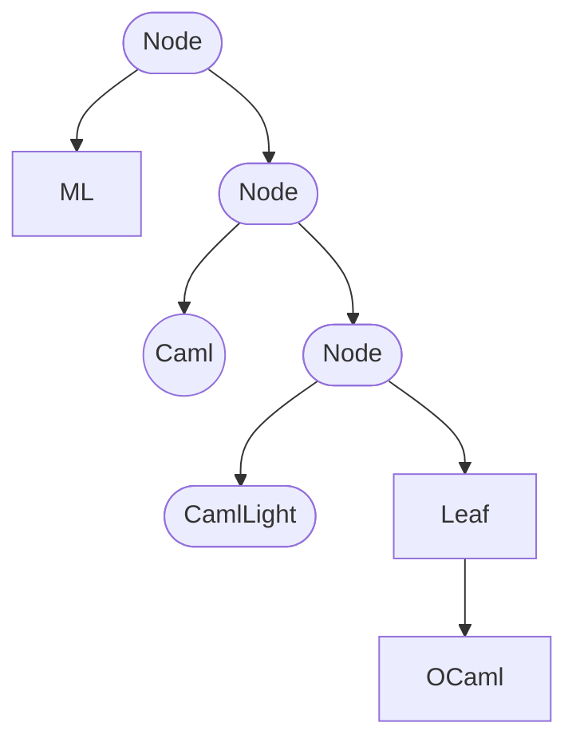

## Introduction

In OCaml, working with functions quickly becomes second nature. We like to think that _functions describe the world_, and like that, we usually write functions that describe how something behaves.

Take for example a function that says hello to a person by name:

```ocaml
# let say_hi name = print_string ("Hello, " ^ name ^ "!\n") ;;
val say_hi : string -> unit = <fun>
```

We can call this function several times, to say "hello" to several people:

```ocaml
#say_hi "Xavier";;
Hello, Xavier!
- : unit = ()

# say_hi "Sabine";;
Hello, Sabine!
- : unit = ()

# say_hi "Joe";;
Hello, Joe!
- : unit = ()
```

If we wanted to say "hello" to the same person multiple times, we'd just _repeat_ the same line of code.

```ocaml
# say_hi "Camel";;
Hello, Camel!
- : unit = ()

# say_hi "Camel";;
Hello, Camel!
- : unit = ()

# say_hi "Camel";;
Hello, Camel!
- : unit = ()
```

One way we can avoid having to repeat these lines every time is by writing a function to say "hi" 3 times:

```ocaml
# let say_hi_3_times name =
  say_hi name;
  say_hi name;
  say_hi name
;;
val say_hi_3_times : string -> unit = <fun>
```

In this function we can see a few behaviors:
* It says "hi" to the same name.
* It repeats it exactly 3 times.

But what would happen if we wanted to say "hi" 2 times? Or 4 or 12 times?

When this happens, it usually means that the function is making certain decision that it shouldn't. In other words, the function **knows something** (like the number of times).

So instead, we will create a function that **let's the caller decide** how many times to say "hi." We do this by requiring a new argument, in this case, `times`:

```ocaml
# let rec say_many_hi times name =
  if times < 1 then ()
  else begin
    say_hi name;
    say_many_hi (times - 1) name
  end
;;
val say_many_hi : int -> string -> unit = <fun>
```

Much better. Now we can call:

```ocaml
# say_many_hi 3 "Xavier";;
Hello, Xavier!
Hello, Xavier!
Hello, Xavier!
- : unit = ()

# say_many_hi 12 "Camel";;
Hello, Camel!
Hello, Camel!
Hello, Camel!
Hello, Camel!
Hello, Camel!
Hello, Camel!
Hello, Camel!
Hello, Camel!
Hello, Camel!
Hello, Camel!
Hello, Camel!
Hello, Camel!
- : unit = ()
```

Unfortunately, reusing this _repetition_ behaviour isn't so easy because we have hard-coded our call to `say_hi`.

To make this reusable, we can **let the caller decide** what our function should do:

```ocaml
# let rec repeat times thing_to_do =
  if times < 1 then ()
  else begin
    thing_to_do;
    repeat (times - 1) thing_to_do
  end
;;
val repeat : int -> 'a -> unit = <fun>
```

But what should `thing_to_do` be? Our intuition may be that we can call:

```ocaml
# repeat 3 (say_hi "Camel");;
Hello, Camel!
- : unit = ()
```

But our program only outputs one salutation:

```
Hello, Camel!
```

That is not what we want! We want it to say "hello" to Camel 3 times.

In OCaml, the arguments are evaluated before the function itself, so in this case, we ended up saying "hi" before we even got to the repeat function.

We can let `repeat` call `say_hi` many times by _delaying_ the function's execution by wrapping it with another function, like this:

```ocaml
# repeat 3 (
fun () ->
    say_hi "Camel");;

This means we must refactor our `repeat` function, by replacing `thing_to_do` with `thing_to_do ()`, to _call_ our new function:

```ocaml
let rec repeat times thing_to_do =
  if times < 1 then ()
  else (
    thing_to_do ();
    repeat (times - 1) thing_to_do)
;;
```

After renaming `thing_to_do` to `fn` we get a nice little `repeat` function:

```ocaml
# let rec repeat times fn =
  if times < 1 then ()
  else begin
    fn ();
    repeat (times - 1) fn
  end
;;
val repeat : int -> (unit -> 'a) -> unit = <fun>
```

And we can use `repeat` to recreate our original `say_many_hi`, or to repeat any work any number of times:

```ocaml
# let say_many_hi times name = repeat times (fun () -> say_hi name);;
val say_many_hi : int -> string -> unit = <fun>

# let print_big_space () = repeat 10 print_newline;;
val print_big_space : unit -> unit = <fun>
```

This is the power of **Higher-Order Functions**. They empower you to create complex behaviors from simpler functions.

Here's some other examples from the real world:

```ocaml
# let say_hi_to_many names = List.iter say_hi names;;
val say_hi_to_many : string list -> unit = <fun>


# module StringSet = Set.Make(String);;
module StringSet :
  sig
    type elt = string
    type t = StringSet.t
    val empty : t [...]
  end

# let only_once fn names =
  names
  |> StringSet.of_list
  |> StringSet.iter fn;;
val only_once : (string -> unit) -> string list -> unit = <fun>

# let yell_hi name =
  name
  |> String.uppercase_ascii
  |> say_hi;;
val yell_hi : string -> unit = <fun>

# let call_for_dinner names = only_once yell_hi names;;
val call_for_dinner : string list -> unit = <fun>
```

## Introduction 2

In the wild, there's certain patterns that repeat over and over again. It's useful to be familiar with them because they are part of the common vocabulary of a functional programmer. Some of them are:

* Pipelining, composition, and chaining
* Filtering
* Mapping
* Folding
* Sorting
* Iterating
* Binding
* Currying and Uncurrying

## Composition

Two functions are _composed_ together first's result passes to the second. This
extends to sequences of functions, each intermediate value is the result of the
previous function and the argument of the following function. These sequences
are called pipelines or chains of composition.

There are several ways to compose functions together. Consider this sequence of
function calls (derived from Ned Batchelder
[gargoyle](https://nedbatchelder.com/blog/201802/a_python_gargoyle.html)):
```ocaml
# let open List in
  let s0 = "1-5,7,9,10-13" in
  let s1 = String.split_on_char ',' s0 in
  let s2 = map (String.split_on_char '-') s1 in
  let s3 = map (map int_of_string) s2 in
  let s4 =
    let f = function
      | [lo; hi] -> List.init (hi - lo + 1) (( + ) lo)
      | u -> u in
    map f in
  let s5 = concat s4 in
  s5;;
- : int list = [1; 2; 3; 4; 5; 7; 9; 10; 11; 12; 13]
```

It converts a string containing page ranges or numbers into a list of page numbers.

Let's define each step as a standalone function. This highlights the chaining of
the calls:
```ocaml
# let f1 = String.split_on_char ',';;
val f1 : string -> string list = <fun>

# let f2 = List.map (String.split_on_char '-');;
val f2 : string list -> string list list = <fun>

# let f3 = List.map (List.map int_of_string);;
val f3 : string list list -> int list list = <fun>

# let f4 =
    let f = function
      | [lo; hi] -> List.init (hi - lo + 1) (( + ) lo)
      | u -> u in
    List.map f;;
val f4 : int list list -> int list list = <fun>

# let f5 = List.concat;;
val f5 : 'a list list -> 'a list = <fun>

# let s0 = "1-5,7,9,10-13" in
  let s1 = f1 s0 in
  let s2 = f2 s1 in
  let s3 = f3 s2 in
  let s4 = f4 s3 in
  let s5 = f5 s4 in
  s5;;
- : int list = [1; 2; 3; 4; 5; 7; 9; 10; 11; 12; 13]
```

Two observations :
- Function types only have a single arrow
- Intermediate types match chained functions' output and input
  1. `string list` : output of `f1` and input of `f2`
  2. `string list list` : output of `f2` and input of `f3`
  3. `int list list` : output of `f3` and input of `f4`
  4. `int list list` : output of `f4` and input of `f5`

The code is more compact if the function calls are nested:
```ocaml
# f5 (f4 (f3 (f2 (f1 "1-5,7,9,10-13"))));;
- : int list = [1; 2; 3; 4; 5; 7; 9; 10; 11; 12; 13]
```

However, this heavy on parenthesis and processing goes the reverse of reading:
or right to left (or inside out the parenthesis).

To avoid this, use the `|>` operator (pronounced “pipe”):
```ocaml
# "1-5,7,9,10-13" |> f1 |> f2 |> f3 |> f4 |> f5;;
- : int list = [1; 2; 3; 4; 5; 7; 9; 10; 11; 12; 13]
```

This removes the parenthesis and executes in the same order as it reads. This is
the same as Unix shell pipe `|`, except the symbol `|>` is used both for
forwarding between functions and providing the initial data. In Unix there are
two: `<` and `|`. That's where the name pipe comes from.

The pipe operator is defined in the standard library, it isn't magic, it's a
function. Here is how it is written:
```ocaml
# let ( |> ) x f = f x;;
val ( |> ) : 'a -> ('a -> 'b) -> 'b = <fun>
```

It receives a value `x` and a function `f` and returns `f` applied `x`. The pipe
operator is a higher-order function, possibly the simplest one.

There is another function application operator: `@@`, which is pronounced
“applied” or “after”.
```ocaml
# ( @@ );;
- : ('a -> 'b) -> 'a -> 'b = <fun>

# f5 @@ f4 @@ f3 @@ f2 @@ f1 @@ "1-5,7,9,10-13";;
- : int list = [1; 2; 3; 4; 5; 7; 9; 10; 11; 12; 13]
```

Here, we remove the parenthesis, but the order is the same as with nested calls.

In the example, chained functions, but `f5`, are _partial applications_ with
constant arguments. Partially applied function receive their work data as their
last parameter. This parameter ordering style is called _t-last_ and is picked
to enable writing pipelines such as in this example.

**Trivia**: The style where parameters are declared with work data first is
called *t-first*. It corresponds to the syntax found in object-oriented
languages where the t-first parameter is the receiver object. In those
languages, pipelines shown in this section are written in dot notation
(something like: `"1-5,7,9,10-13".f1().f2().f3().f4().f5()`).

## Mapping

Sometimes we need to apply a function over data inside a container and produce
an identically shaped container with the functions' results. Initial and
produced contained data types may be different.

For example, if we have a list of user identifiers, we want to get a list of
printable names. Both lists have the same number of elements and the order
between corresponding values is the same. In another example, if we have an
optional password, we can encrypt it only if it is set.

This is called _mapping over_ and should not be confused with a map or a
mapping, which is a key-value store. See [maps](/docs/maps) for more on those
mappings.

### Mapping over Lists

This mapping uses pattern matching over a list and recursively reconstructing a
similarly shaped list:
```ocaml
# let rec list_map f = function
  | [] -> []
  | head :: tail -> f head :: list_map f tail;;
val list_map : ('a -> 'b) -> 'a list -> 'b list = <fun>
```

We use the `::` constructor both to pattern match the parameter list and
construct the result list.

The map over lists function is defined as [`List.map`](/api/List.html#VALmap) in
the standard library.

### Mapping over Options

Options, which contain zero or one datum can be mapped over too. Mapping is not
limited to collections. As with `list_map` a result option is reconstructed from
the option parameter, using pattern matching. No recursion is needed.
```ocaml
# let option_map f = function
  | Some value -> Some (f value)
  | None -> None;;
val option_map : ('a -> 'b) -> 'a option -> 'b option = <fun>
```

Both sides of the match return the same kind of thing: if we had a `None` we
return `None`, if we have a `Some` we return a `Some`. This way, the structure
is preserved.

The map over options function is defined as
[`Option.map`](/api/Option.html#VALmap) in the standard library.

### Mapping over Results

When we have a `result` values there are two possible ways in which we can
change the internal value, both are valid maps.

We change the `Ok` value and leave the `Error` value unchanged, or we can do the
other way round.
```ocaml
# let map_ok f = function
    | Ok value -> Ok (f value)
    | Error reason -> Error reason;;
val map_ok : ('a -> 'b) -> ('a, 'c) result -> ('b, 'c) result = <fun>

# let map_err f = function
    | Ok value -> Ok value
    | Error reason -> Error (f reason);;
val map_err : ('a -> 'b) -> ('c, 'a) result -> ('c, 'b) result = <fun>
```

Both of these are useful in different cases. such as wanting to change the
type of errors, or only perform operations once we have an `Ok` value.

The map over errors function are defined as
[`Result.map`](/api/Result.html#VALmap) and
[`Result.map_error`](/api/Result.html#VALmap_error) in the standard library.

It also possible to define map over results a single function with two
higher-order parameters:
```ocaml
# let result_map f g = function
    | Ok value -> Ok (f value)
    | Error reason -> Error (g reason);;
val result_map :
  ('a -> 'b) -> ('c -> 'd) -> ('a, 'c) result -> ('b, 'd) result = <fun>
```

Usage has shown that it is more frequent to need to change a result's value than
a results error. Therefore, it is more convenient to have two dedicated maps for
results than a single one.
```ocaml
# let result_map ?(error = Fun.id) f = function
    | Ok value -> Ok (f value)
    | Error reason -> Error (error reason);;
```

### Mapping over Sequences


### Mapping over Custom Data Types

When working with custom data types, it is possible to write custom map
functions. Container shapes must be preserved. Here is an example with a custom
type of binary trees and the corresponding map function:
```ocaml
# type 'a tree =
    | Leaf
    | Node of 'a * 'a tree * 'a tree;;
type 'a tree = Leaf of 'a | Node of 'a * 'a tree * 'a tree

# let rec tree_map f g = function
    | Leaf x -> Leaf (f x)
    | Node (x, lft, rht) -> Node (g x, tree_map f lft, tree_map f rht);;
val tree_map : ('a -> 'b) -> 'a  tree -> 'b tree = <fun>
```

The shape of the tree is preserved, but every time we encounter a value `x`, we
use `f x` instead. Also, `tree_map`'s type looks like other's:
```ocaml
# List.map;;
- : ('a -> 'b) -> 'a list -> 'b list = <fun>

# Option.map;;
- : ('a -> 'b) -> 'a option -> 'b option = <fun>
```

To define a map function for your custom data behaving as those presented in
this section, you must make sure it satisfies these properties:
- Mapping the identity function does not do anything: `d` and `map Fun.id d` are
  the same for any custom data `d`.
- Mapping of function composition produces the same result as the composition of
  maps: `map (fun x -> x |> f |> g) d` and `d |> map f |> map g` produce the
  same results for any custom data `d`.

Let's revisit the page numbers example. First, we give names to the function
passed to `List.map`:
```ocaml
# let g2 = String.split_on_char '-';;
val g2 : string -> string list = <fun>

# let g3 = List.map int_of_string;;
val g3 : string list -> int list = <fun>

# let g4 = function
  | [lo; hi] -> List.init (hi - lo + 1) (( + ) lo)
  | u -> u;;
val g4 : int list -> int list = <fun>
```

The pipeline becomes this:
```ocaml
"1-5,7,9,10-13" |> f1 |> List.map g2 |> List.map g3 |> List.map g4 |> f5;;
- : int list = [1; 2; 3; 4; 5; 7; 9; 10; 11; 12; 13]
```

But using the property on map composition, it is possible to write it like that:
```ocaml
"1-5,7,9,10-13" |> f1 |> List.map (fun x -> x |> g2 |> g3 |> g4) |> f5;;
- : int list = [1; 2; 3; 4; 5; 7; 9; 10; 11; 12; 13]
```

The result is the same but using a single map is more efficient.

## Folding

Sometimes we want to iterate over data and collect the results as we go from
element to element. This behavior is called _folding_ or _reducing_, and
produces a result combining the container's data.

For example, if we have a list of numbers, we can add them together using a fold:
```ocaml
# List.fold_left ( + ) 0 [1; 2; 3; 4; 5; 6; 7; 8; 9; 10];;
- : int = 55
```

### Folding over Lists

There are two different ways to fold lists. They depend on the way intermediate
results are associated, to the left or right. The difference appears when the
combining function produces different results if its arguments are flipped.
```ocaml
# List.fold_left;;
- : ('acc -> 'a -> 'acc) -> 'acc -> 'a list -> 'acc = <fun>

# List.fold_right;;
- : ('a -> 'acc -> 'acc) -> 'a list -> 'acc -> 'acc = <fun>

# let f = Printf.sprintf "(%s + %s)";;
val f : string -> string -> string = <fun>

# let u = List.init 5 (fun i -> string_of_int (i + 1));;
val u : string list = ["1"; "2"; "3"; "4"; "5"]

# List.fold_left f "0" u;;
- : string = "(((((0 + 1) + 2) + 3) + 4) + 5)"

# List.fold_right f u "0";;
- : string = "(1 + (2 + (3 + (4 + (5 + 0)))))"
```

Here, `fold_left` and `fold_right` are applied to the same arguments, but their
results are different.

**Fun Fact**: A map is a special fold.
```ocaml
# let list_map u = List.fold_right (fun x u -> f x :: u) u [];;
val list_map : ('a -> 'b) -> 'a list -> 'b list = <fun>

# list_map (fun x -> x * x) [1; 2; 3; 4; 5];;
- : int list = [1; 4; 9; 16; 25]

```

### Folding over Options, Results, Sequences and Arrays

Consider this function and compare its type to `List.fold_left`'s.
```ocaml
# let option_fold (f : 'b -> 'a) default = function
    | None -> default
    | Some x -> f x;;
val option_fold : ('b -> 'a) -> 'a -> 'b option -> 'a = <fun>

# List.fold_left;;
- : ('a -> 'b -> 'a) -> 'a -> 'b list -> 'a = <fun>
```

Functions have similar types:
- Higher-order parameter having a `'b` parameter and an `'a` result
- Initial or default data of type `'a`
- Work data containing values of type type `'b`
- Result of type `'a`

In the standard library, this function is defined as [Option.fold](/api/Option.html#VALfold), using
labeled parameters. That gives it a different signature, but the behavior is the
same.

Folding over sequences or arrays is similar in type and behavior:
```ocaml
# Array.fold_left;;
- : ('a -> 'b -> 'a) -> 'a -> 'b array -> 'a = <fun>

# Seq.fold_left;;
- : ('a -> 'b -> 'a) -> 'a -> 'b Seq.t -> 'a = <fun>

# Array.fold_left ( + ) 0 [| 1; 2; 3; 4; 5; 6; 7; 8; 9; 10 |];;
- : int = 55

# Seq.(fold_left ( + ) 0 (take 10 (ints 1)));;
- : int = 55
```

Folding on results is similar to `Option.fold`:
```option
# Option.fold;;
- : none:'a -> some:('b -> 'a) -> 'b option -> 'a = <fun>
```

It is defined using labeled parameters. This fold builds its result by applying
its parameter function to the `Ok` value. Unlike `map`, which had two versions
for results, there is a single fold. It is very rarely needed, if you ever do,
you have to define it yourself.

### Folding over Custom Data Types

Here are two functions working on the type `tree`
[previously](#mapping-over-custom-data-types) defined.
```ocaml
# let rec sum = function
    | Leaf -> 0
    | Node (x, lft, rht) -> x + sum lft + sum rht;;

# let rec height = function
    | Leaf -> 0
    | Node (_, lft, rht) -> 1 + max (height lft) (height rht);;

# let t = Node (1,
            Node (2, Leaf, Leaf),
            Node (3, Node (4, Leaf, Leaf), Leaf));;
val t : int tree =
  Node (1, Node (2, Leaf, Leaf), Node (3, Node (4, Leaf, Leaf), Leaf))

# sum t;;
- : int = 10

# height t;;
- : int = 3
```

They provide the pattern to define fold over `tree`:
```ocaml
# let rec tree_fold f default = function
    | Leaf -> default
    | Node (x, lft, rht) ->
        f x (tree_fold f default lft) (tree_fold f default rht);;
val tree_fold : ('a -> 'b -> 'b -> 'b) -> 'b -> 'a tree -> 'b = <fun>

# tree_fold (fun x y z -> x + y + z) 0 t;;
- : int = 10

# tree_fold (fun _ l r -> 1 + max l r) 0 t;;
- : int = 3
```

Lists can be folded in two ways: left or right. Here, we only show one fold for
`tree`. Several others are possible, depending on the way the tree is traversed
and the combined results are formed from subexpression results.

**Remark**: Fold functions for a custom variant type having _n_ constructors
have _n + 1_ parameters. Constructors without data (such as `None`, `[]` and
`Leaf`) correspond to default or initial data parameters. Constructors with data
(such as `Some`, `::`, `Ok` or `Node`) correspond to higher-order parameters. A
fold for a type with several data-free constructors and several data-carrying
constructors will need more parameters. The additional parameter is the
data-carrying one, from the custom variant type.

## Unfolding

The OCaml standard library only provides unfold on sequences.
```ocaml
# Seq.unfold;;
- : ('b -> ('a * 'b) option) -> 'b -> 'a Seq.t = <fun>

# Seq.unfold (fun n -> Some (n * n, n + 1)) 0 |> Seq.take 10 |> List.of_seq;;
- : int list = [0; 1; 4; 9; 16; 25; 36; 49; 64; 81]
```

Whilst `Seq.fold` reduces a sequence into a single value, for instance the sum
of its contents, `Seq.unfold` produces a sequence from an initial value.

Unfold functions are seldom needed to have to define custom fold functions (that )
```ocaml
# let rec list_unfold f x = match f x with
    | None -> []
    | Some (y, x) -> y :: list_fold f x;;
val list_unfold : ('a -> ('b * 'a) option) -> 'a -> 'b list = <fun>

# list_unfold (fun n -> if n < 10 then Some (n * n, n + 1) else None) 0;;
- : int list = [0; 1; 4; 9; 16; 25; 36; 49; 64; 81]

# let rec tree_unfold f x = match f x with
    | None -> Leaf
    | Some (y, x_lft, x_rht) -> Node (y, tree_unfold f x_lft, tree_unfold f x_rht);;
```

## Iterating

We usually think of iteration when we think of looping, and going through collections of things:

* loop through elements in a list
* go over the keys in a map

But in OCaml the pattern for iteration can be extended to other kinds of data types, like optional values or results, or trees and lazy sequences.

Iterating in OCaml means that if there is a value (or more), we'd like to apply a function to it.

### Iterating over Lists

A list in OCaml is a linked-list that is composed by a head (the first element) and a tail (the rest of the list).

We can iterate over lists by pattern matching on then. When doing so, we either get an empty list (`[]`), or we get a pattern with a head and a tail (`n :: rest`). On the branch with a head and a tail, we can directly use the head value and apply a function to it, and then recurse with the tail.

```ocaml
let rec print_nums nums =
  match nums with
  (* if the list is empty, we do nothing *)
  | [] -> ()
  (* if the list is not empty... *)
  | n :: rest ->
    (* we print the first element *)
    Printf.printf "%d\n" n;
    (* and repeat over the rest of the list *)
    print_nums rest
```

Now if we wanted to do something else with each element of the list, we could just _ask_ for a function that will run over them:

```ocaml
let rec print_all fn nums =
  match nums with
  | [] -> ()
  | n :: rest ->
    fn n;
    print_all fn rest
```

And this way we can call `print_all` with any function `fn`, so it really is just iterating over the list and running a function over every element.

That's exactly how `List.iter` is defined in the standard library.

### Iterating over Options and Results

Another kind of data it is common to iterate over in OCaml is optional and result values. Normally, we want to run a function only if the option has _Some value_ in it or if there is an _Ok value_. If there is no value in it, or if we have an _Error_, we don't want to do anything.

We can do this by pattern-matching on our value and calling our function over the inner value in the Some or Ok branch.

```ocaml
let run_if_some opt fn =
  match opt with
  | Some value -> fn value
  | None -> ()
;;

let run_if_ok res fn =
  match res with
  | Ok value -> fn value
  | Error _  -> ()
;;
```

This is how `Option.iter` and `Result.iter` are defined in the standard library.

### Iterating over Maps and Sets

Larger collections of data like maps and sets, are also common in OCaml. We have dedicated modules for them but they have a _functor_ interface. This means you can't really use `Set` or `Map` directly, but you have to call the module-level function `Set.Make` to create your own custom version of the Set module for the specific types you want to store in it.

Once you create your Set or Map module, you'll find they provide functions to convert their values into lists.

With either of those functions, we can put together an iterator over maps or sets:

```ocaml
let iter values collection fn  =
  let values : 'a list = values collection in
  List.iter fn values
;;

module StringSet = Set.Make(String);;
module IntMap = Map.Make(Int);;

let iter_map map fn = iter IntMap.bindings map fn ;;
let iter_set set fn = iter StringSet.elements set fn ;;
```

You'll notice that we did not use pattern-matching this time around to iterate over the values of the Map or the Set directly. This is because   the representation of Sets and Maps is private.

The actual implementation of iteration functions for Maps and Sets does use pattern-matching under the hood.

### Iterating over Lazy Sequences

Usually, a module that implements some data type will provide functions that iterate over it.

But some data is _lazy_, and it only lets us access one element at a time. So if the data looked like `[1,2,3]` you'd only be able to _compute_ the 3rd value after accessing the first and second ones.

Lazy sequences in OCaml are represented with the `Seq` module, which has a function called `uncons` to get the next element. This function also returns the new sequence that we can use to get the 2nd element, and so on.

```ocaml
let rec iter seq fn =
  match Seq.uncons seq with
  | None -> ()
  | Some (value, seq2) ->
    fn value;
    iter seq2 fn
;;
```

This function will try to get the first element of the sequence, and if there is one, run our function `fn` over it. Then it will repeat over the new sequence (`seq2`) which starts at the second element.

This is almost exactly how `Seq.iter` is defined in the standard library.

### Iterating over custom data types

So far we've seen how to iterate over data types from the standard library. Now we'll see how to iterate over our own data type for trees.

We'll define our tree type to include 2 constructors. One for a leaf node, which is a node at the _end_ of the tree. The other one for nodes that have children.

```ocaml
type 'value tree =
 | Leaf of 'value
 | Node of 'value tree * 'value
;;
```

So our data type allows us to represent tree-like data:



Now before we define our iteration function, its important to define what iteration means for our data type. Do we want to iterate from the bottom of the tree? Do we want to iterate from the top? Should we do middle-out?

For our example, we'll iterate from the top down as we go along:

```ocaml
let rec iter tree fn =
  match tree with
  | Leaf value -> fn value
  | Node (tree2, value) ->
      fn value;
      iter tree2 fn
;;
```

Again, we iterate by pattern matching on values, applying a function to the deconstructed value and recursing over the remaining data.

## Sorting

Another common behavior usually implemented with higher-order functions is sorting collections.

Both `Array.sort` and `List.sort` implement an interface where if you pass in a function that knows how to compare 2 elements, they'll adapt the sorting to use this comparison.

For arrays, this operation mutates the array in-place:

```ocaml
let array = [| 4;9;1;10 |];;

(* sorts the array in ascending order *)
Array.sort (fun a b -> a - b) array;;

(* sorts the array in descending order *)
Array.sort (fun a b -> b - a) array;;
```

For lists, this operation returns a new sorted list:

```ocaml
let list = [4;9;1;10] ;;
let asc = List.sort (fun a b -> a - b) list ;;
let desc = List.sort (fun a b -> b - a) list ;;
```

Most OCaml modules include a `compare` function that can be pass in to `sort`:

```ocaml
let int_array = [|3;0;100|];;
Array.sort Int.compare int_array;;

List.sort String.compare ["z";"b";"a"];;

List.sort Bool.compare [true;false;false];;
```


## Binding

One last common higher-order pattern in functional programming is the ability to _join_ data from within. For historical reasons, this is normally called a _bind_.

For example, if we have a list, and map over it with a function that returns a list, then we'll have a list of lists. Sometimes we want this, but some times we would rather the new list was _flattened_ instead of _nested_.

To do this with lists we can use the `concat_map` function, which looks like this:

```ocaml
let twice x = [x;x];;
let double ls = List.concat_map twice ls;;

double [1;2;3];; (* [1;1;2;2;3;3] *)
```
### Binding as early returns

This same pattern is useful to build chains of functions that _short circuit_ on specific values.

For example, if you had to retrieve a user from a database, and *only if there is a user* try access the user's email, you could use `Option.bind` to short-circuit on the first operation:

```ocaml
type user = {
    email: string option
}

let get_user () = None ;;
let get_email user = user.email ;;

let email = Option.bind (get_user ()) get_email ;;
```

In this example, because our `get_user ()` call returns None, `get_email` will never be called. Only if `get_user` returns `Some user` does `get_email` be called.

This also applies to result values:

```ocaml
type user = {
    email: string
}

let get_user () = Error `no_database ;;
let get_email user = Ok user.email ;;

let email = Result.bind (get_user ()) get_email ;;
```

The main difference is that in this case `Result.bind` is biased towards `Ok value`, so that if a result value is an `Error reason`, it will short-circuit through the binds and just return the first error that appears.

### Let-ops

Unfortunately, calling `Result.bind` can be a bit awkward. We can't pipe our value through a series of binds like we can do with calls to `map`. For example, this isn't valid:

```ocaml
let email = get_user ()
           |> Result.bind get_email
           |> Result.bind extract_domain
           |> Result.bind validate_domain
           ;;
```

Thankfully, OCaml lets us redefine a subset of operators called _let-operators_ that can be used to streamline the use of `bind` calls by making them look very close to normal let-bindings:

```ocaml
(* first we will declare out let* operator to be equal to Result.bind *)
let (let*) = Result.bind

let* user = get_user () in
let* email = get_email user in
let* domain = extract_domain email in
validate_domain domain
```

This has the advantage of making code a lot more readable, without changing the behavior we've come to expect from bind calls.

### Async code

Async libraries for OCaml that implement Promises/Futures usually also have a `bind` function that allows you to chain computations.


<!-- ## 3. Recipes

## How to flip the order of arguments?

For a function with 2 arguments, use `Fun.flip`:

```ocaml
let div a b = a / b;;
let vid = Fun.flip div;;

div 10 1 = vid 1 10
;;
```

For functions with more than 2 arguments consider wrapping it in a lambda that gives you more flexibility:

```ocaml
let create_user name email password = `user (name,email,password);;

let create_user2 email password name = create_user name email password;;
```

If you own the function, consider giving it named parameters to allow calling it with arguments out of order:

```ocaml
let create_user ~name ~email ~password = `user (name,email,password);;
```

## What to do when there are too many higher-order functions?

If you find yourself calling a function that has too many function parameters, to the point that the types get hard to track, or the ordering is ambiguous, consider:

1. using named parameters for the functions
2. creating a record of functions

To create a record of functions, it is best if the amount of type-variables is low:

```ocaml
type error = [ `bad_network ]
type ('input, 'output) operations = {
  create_record: 'input -> ('output, error) result;
  update_record: 'input -> ('output, error) result;
  read_record: 'input -> ('output, error) result;
  delete_record: 'input -> ('output, error) result;
}
``` -->

<!--
Comment

let f () = 42
let f () = g 42

One possible issue with the repeat function used in the intro comes from the fact
it is used to produce a side effect. Therefore two stories get mixed together, writing
a higher-order iterator and deferring evaluation of a side effect producing function in
order to repeat it.

On one hand, it is good because it feels more real life, on the other hand it makes
a bigger story mixing two problems.

In CS3110, `twice` and `repeat` are pure functions
```ocaml
let twice f x = f (f x)

let rec repeat f n x = if n = 0 then x else repeat f (n - 1) (f x)
```

Trouble with those function is they aren't very realistic, but they are easier to understand (I believe).
```ocaml
twice (fun s -> "hello " ^ s) "leandro"
```

What do you think?

-->

## Currying and Uncurrying

Since in OCaml all functions really just take one parameter, when you call `add x y`, you're actually calling two functions! `((add x) y)`

Sometimes it helps to apply _parts_ of a function in different orders, and sometimes it helps to make a function really take all its parameters _at once_.

This is what we call currying and uncurrying:

* A curried `add` function will be called like `add x y`.
* An uncurried `add` functoin will be called liked `add (x, y)`. Note how this is really just one argument!

Before we get to some examples, let's define some helper functions that will help us curry and uncurry functions.

### Uncurrying

Our uncurry helper is a function that takes one function as input and returns another function. It is essentially a wrapper.

The input function must have type `'a -> 'b -> 'c`. This is the type of any function that takes 2 parameters.

The output function will have type `('a * 'b) -> 'c`. Notice how the arguments `'a` and `'b` are now bundled together in a tuple!

Here's our helper:

```ocaml
(* [uncurry] takes a function that is normally curried,
   and returns a function that takes all arguments at once. *)
# let uncurry f (x, y) = f x y;;
val uncurry : ('a -> 'b -> 'c) -> 'a * 'b -> 'c = <fun>
```

If we wanted to write `uncurry` for more arguments, we'd just make a new `uncurry3` or `uncurry4` or even `uncurry5` function that would work exactly the same:

```ocaml
# let uncurry4 f (w, x, y, z) = f w x y z;;
val uncurry4 : ('a -> 'b -> 'c -> 'd -> 'e) -> 'a * 'b * 'c * 'd -> 'e = <fun>
```

Uncurrying can be very useful when you're dealing with lists (which we do a lot in OCaml) and when the list happens to have tuples.

Take for example this list of tuples of names and favorite emojis:

```ocaml
# let people = [
  "🐫", "Sabine";
  "🚀", "Xavier";
  "✨", "Louis";
]
;;
```

If we wanted to do something with any of these elements, we'd need to split the tuple, and call a function:

```ocaml
# let greet emoji name =
  Printf.printf "Glad to see you like %s, %s!\n" emoji name
;;

let emoji, name = List.hd people in
# greet emoji name
;;
```

But we can also uncurry our `greet` function to operate over the entire tuple!

```ocaml
# uncurry greet (List.hd people)
;;
```

### Currying

On the other hand, sometimes we have functions that already work with tuples, and we'd like to use them like functions that take multiple arguments.

For that we can define a little `curry` helper that will take a function as input, and return another function as output. It is essentially a wrapper.

The input function must have type: `('a * 'b) -> 'c` – this is the type of any function that one tuple with 2 parameters.

The output function will have type `'a -> 'b -> 'c` – notice how the arguments `'a` and `'b` are now unbundled!

Here's our helper:

```ocaml
(* [curry] takes a function that is normally curried,
   and returns a function that takes all arguments at once. *)
let curry f x y = f (x, y)
;;
```

If we wanted to write `curry` for more arguments, we'd just make a new `curry3` or `curry4` or even `curry5` function that would work exactly the same:

```ocaml
let curry4 f w x y z = f (w, x, y, z)
;;
```

Currying can be very useful when you're dealing with lists (which we do a lot in OCaml) and when the list has a single value, but your function takes more than one.

Take for example this list of names and an uncurried revealing function:

```ocaml
let names = [
  "Sabine";
  "Xavier";
  "Louis";
]
;;

let reveal (title, name) =
  Printf.printf "But it was %s, %s!\n" title name
;;
```

If we wanted to use `reveal` on a name, we have to put it into a tuple, and then do the call. Like this:

```ocaml
List.iter (fun name ->
  let title = "The OCamler" in
  reveal (title, name)) names
;;
```

But we can also curry our `reveal` function to take 2 arguments!

```ocaml
List.iter (curry reveal "The OCamler") names
;;
```

### Readability Notes

Currying and uncurrying is all fun and games until your code gets very hard to read.

Sometimes it makes sense to curry a function, and sometimes the clearer thing is to manually wrap it in a function.

For example, this is a pipeline with a lot of currying/uncurrying that would most likely be easier to read and maintain if we manually wrote out the wrapper functions:

```ocaml
let do_and_return f x = f x; x
;;

let flip (x, y) = (y, x)
;;

names
|> List.map (do_and_return (greet "👋🏼"))
|> List.map (Fun.flip List.assoc (List.map flip people))
|> List.iter (curry reveal "The OCamler")
;;
```

Versus a much more readable and easier to maintain version:

```ocaml
let find_by_name name1 =
  List.find (fun (_emoji, name2) -> name1 = name2) people
;;

(* first iterate over the names, greeting them *)
names |> List.iter (greet "👋🏼")
;;

(* then find the right emoji by name *)
names
|> List.map find_by_name
|> List.iter (fun (emoji, _name) -> reveal ("The OCamler", emoji))
;;
```


<!--
**What you'll learn**:
* What is a higher-order function
* What are some common higher-order functions
* What is function composition
* How to compose functions
* How to make reusable functions
* How to make functions fit anywhere

**(INTERNAL): journey:**
* introduction – motivate the existence of higher-order functions with an example
* how do i make new functions from existing functions?
* composing pipelines and `|>`
    * t-first vs t-last
* point-free composition
    * how we can do it
    * why we don't do it
* usual gotchas / patterns
    * i need a function that does nothing: Fun.id
    * my function is backwards: flip
    * my function takes too many params:
        * if you can, name it
        * partial application in pipelines
        * they're in the wrong order
            * lambda wrappers (fun x -> f 123 x true)
-->